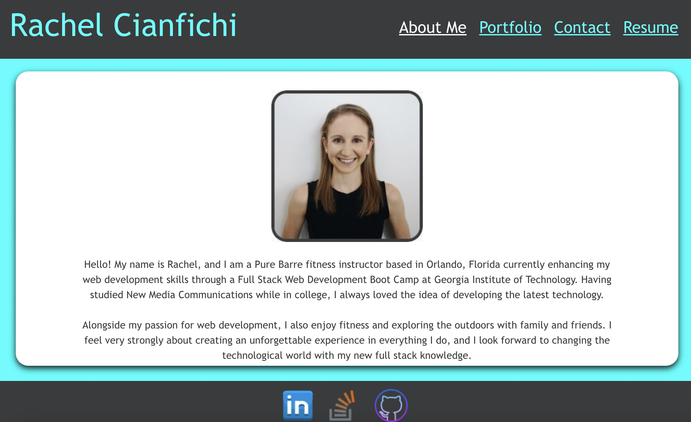

# Rachel Cianfichi React Personal Portfolio

  

  ## Description
  Personal portfolio, single page application, created with React. View the rendering of page components such as personal information, portfolio projects, contact ability and skills & a resume. The header with a navbar as well as the footer persist among the injection of various page layouts. This application as built with React, React Router DOM, Bootstrap, Cloudinary, and CSS.

  ## Table of Contents
  * [Installation](#installation)
  * [Usage](#usage)
  * [License](#license)
  * [Contact](#contact)

  ## Installation
  After cloning application, run "npm install" to use it locally.

  ## Usage
  Run "npm start" to view application on a local host or click [here](https://cianfich1016.github.io/React-Portfolio/#/about) to view the live deployed link. 

  Images of portfolio:

  
  
  

  ## License
  License for this project: [MIT License](https://choosealicense.com/licenses/mit/)

  ## Contact
  With any questions or concerns, please contact me via GitHub at [cianfich1016](https://github.com/cianfich1016) or by email at cianfich@gmail.com.

